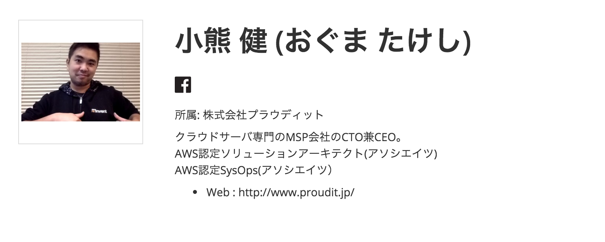

来たる、2016/3/12(土)に今年も[JawsDays2016](http://jawsdays2016.jaws-ug.jp/)が開催されます。

AWSの成長とともに、年々参加者、規模も大きくなっているJawsdays、毎年1ユーザとして楽しみに参加させて頂いておりまししたが、今年はなんと、私小熊がスピーカーの一人として参加する機会を頂きました！

以下、私のセッションの紹介ページ抜粋です。
 

---
###11時10分- 静的HTML公開フローをサーバレスでDevOps！
---

株式会社プラウディットの小熊さんがお届けする「静的HTML公開フローをサーバレスでDevOps！」は、ほぼ絶対落ちないコーポレートサイトを、Github + CircleCi + AWSのS3というストレージサービスを利用して、サーバレスで構築するハンズオンです。 このセッションに参加すれば、あなたのサイトも簡単にYahoo砲に耐えられるようになります！

[スピーカー紹介ページ](http://jawsdays2016.jaws-ug.jp/speaker/259)

---

 

セッションブースは「workshop」＝いわゆるハンズオンブースの１コマとなります。

もちろん、元ネタは同Blogの同名記事[静的HTML公開フローをサーバレスでDevOps！](http://blog.proudit.jp/2015/11/27/github-circleci-s3.html)がベースとなっておりますが、ハンズオン用にブラッシュアップしましたので、この記事ではよく分からなかった、うまく行かなかった、などの方にも分かりやすく、試しやすい形となっております。

1コマ=50分の短いセッションですが、AWS S3と各種SaaSを連携したDevOpsの要素満載のセッションとなります。

みなさまお誘い合わせの上、受講頂ければと思います！

まだチケット間に合いますよーw

[JawsDaysチケット販売ページ](https://jaws-days.doorkeeper.jp/events/36835)
